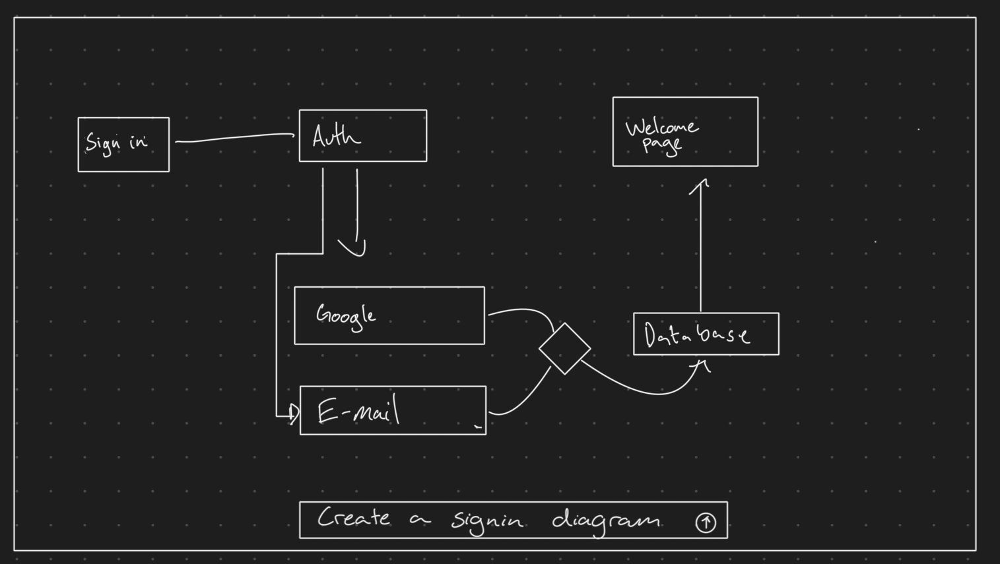
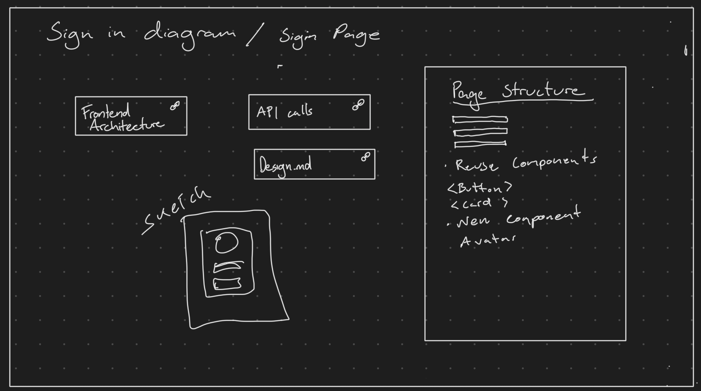
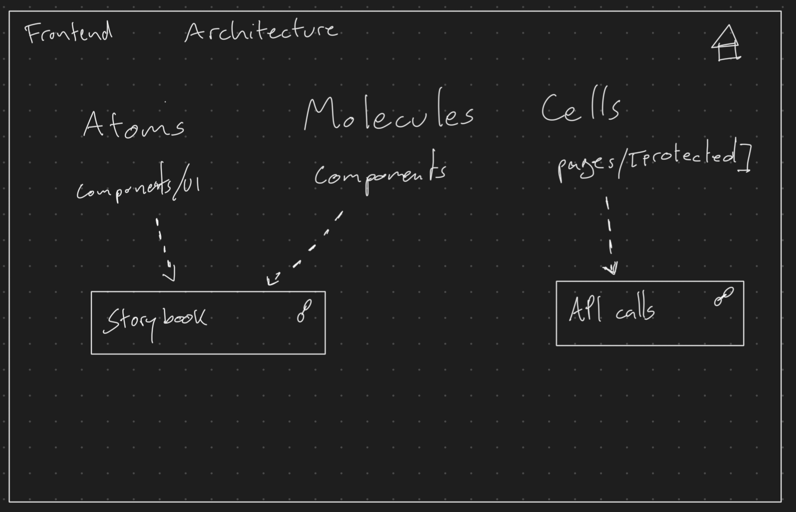
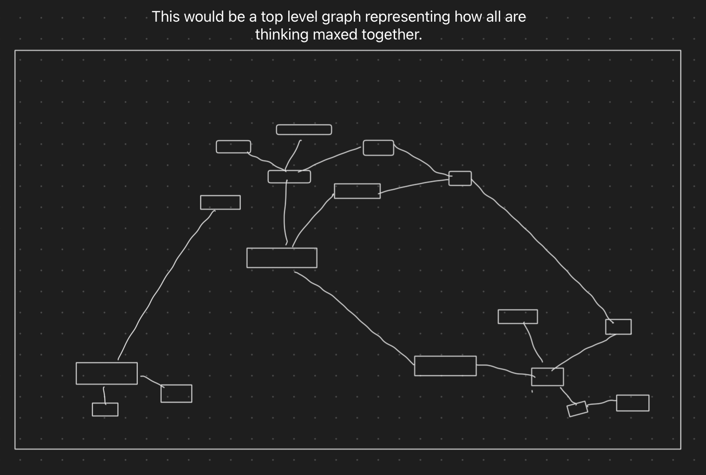

# Origin Sketches

Hand-drawn user-interaction sequence for the structure-first direction. These are the
source material for every decision in `MERMAID-DOCS.md` — when a decision there seems
arbitrary, the answer is usually in one of these four frames.

## 01 — Prompt to diagram

An empty canvas with a prompt bar at the bottom: *"Create a signin diagram."* The model
answers with a flowchart — `Sign in → Auth`, branching to `Google` and `E-mail`, through a
decision node to `Database`, ending at `Welcome Page`.

The boxes are **real shapes**, not a rendered picture. This is why the parser produces one
shape per box rather than an image (`parseMermaid` → `{nodes, edges}`).

## 02 — Scoped canvas with references

Dive into the `Sign in` box and you get its own canvas, titled *"Sign in diagram / Signin
Page."* Inside: reference boxes marked with a link glyph (`Frontend Architecture`,
`API calls`, `Design.md`), a freehand wireframe sketch, and a `Page Structure` document
holding real prose — *"Reuse Components `<Button>` `<Card>`, New Component: Avatar."*

Three things this frame establishes:

- A canvas mixes **generated diagrams, referenced docs, freehand sketches and Markdown
  prose** on one surface
- References carry a **visual marker** — you can see at a glance which boxes point
  elsewhere versus which hold their own content
- The scoped canvas is where the *focused conversation* happens

## 03 — Nested doc canvas

Dive into `Frontend Architecture` from the previous frame. Its canvas captures decisions
as structure: `Atoms → components/UI`, `Molecules → Components`, `Cells → pages/[protected]`,
with dashed arrows into `Storybook` and `API calls`. A home glyph sits top-right.

Nesting **recurses** — there's no special "leaf" level. And `API calls` appears here *and*
on frame 02: one document, two placements. This frame is why canvases hold
`{docId, position}` rather than the documents themselves.

## 04 — Global graph

Captioned *"This would be a top level graph representing how all our thinking meshed
together."* Every box from every canvas, connected, force-laid-out — no labels, because at
this zoom the shape is the information.

Nobody draws or maintains this view. It is a **query** over all docs and all references.
This is the Obsidian graph view, except the nodes hold conversations and diagrams rather
than only text.
